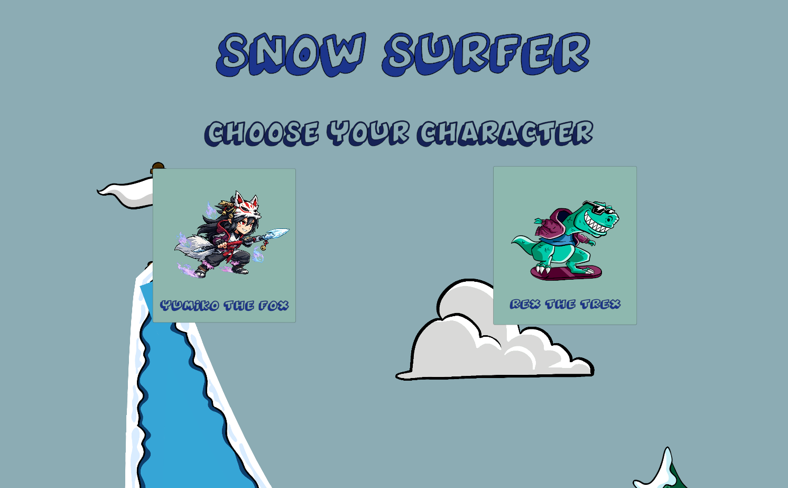
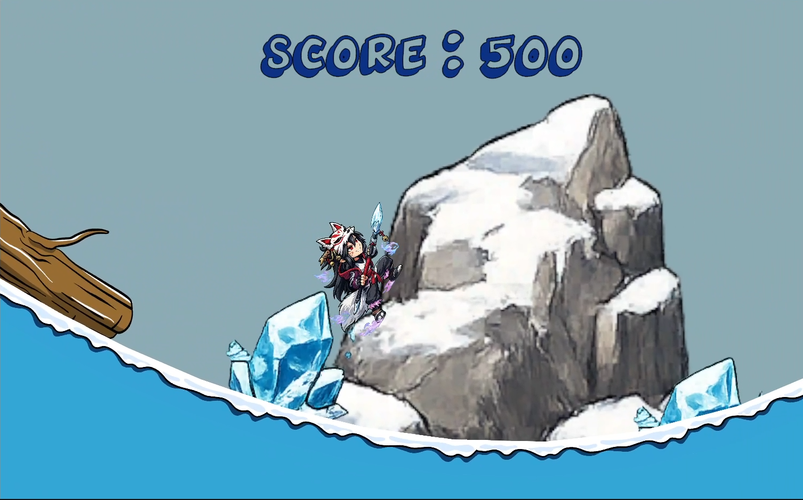
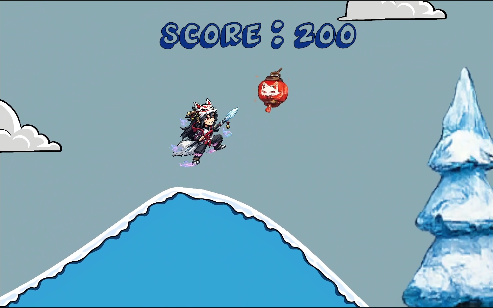
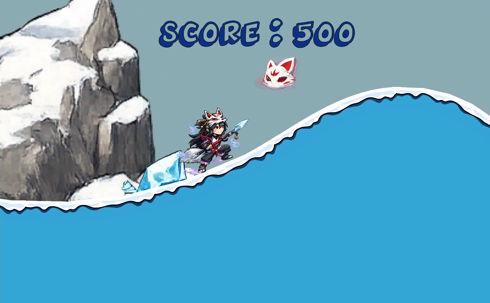
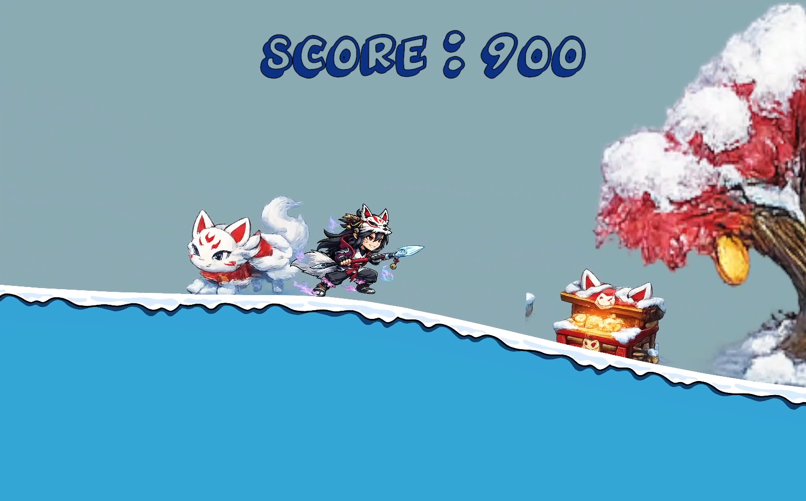
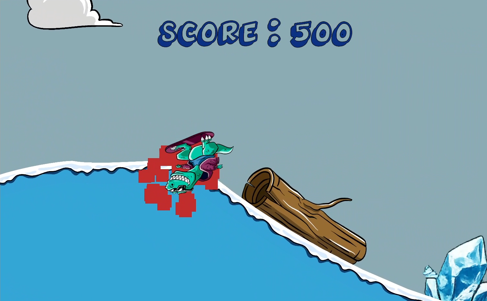

# 🏂 Snow Surfer

A fast-paced 2D snowboarding game built in Unity where players surf across snowy slopes, perform flips, collect powerups, avoid obstacles, and chase high scores.

This project was created as part of my game development learning journey while exploring Unity physics, player movement, scoring systems, and game design fundamentals.

---

## 🎥 Gameplay Showcase

Watch the full showcase video here:

🔗 [LinkedIn Showcase Video](https://www.linkedin.com/posts/krishna-tyagi-a620a1376_unity-gamedevelopment-indiedev-ugcPost-7478020459008274433-GZZg/)

---

## 📸 Screenshots

  
  
  

  
  
  

---

## 🎮 Features

### 🏂 Dynamic Snowboarding Gameplay
- Smooth downhill movement
- Physics-based jumps and landings
- Score progression system

### 🔄 Flip System
- Perform aerial flips while jumping
- Earn style points while staying in control

### ⚡ Powerups
- Collect special powerups during gameplay
- Different powerups provide unique gameplay advantages

### 👥 Character Selection
Choose between two unique characters:

- Yumiko the Fox
- Rex the T-Rex

### 🚧 Obstacles & Hazards
- Crash detection system

### 💥 Visual Feedback
- Particle effects
- Damage effects
- Powerup visuals

### 🏆 Scoring System
- Real-time score tracking
- Reward exploration and successful runs

---

## 🎯 Objective

Travel as far as possible, collect powerups, perform flips, avoid obstacles, and achieve the highest score you can before crashing.

---

## 🕹 Controls

| Key | Action |
|------|--------|
| A | Rotate Left |
| D | Rotate Right |
| ↑ Up Arrow Key | Speed Boost |

---

## 🛠 Built With

- Unity
- C#
- Visual Studio Code

---

## 📚 What I Learned

Through this project I practiced:

- Unity Physics
- Rigidbody Movement
- Collision Detection
- Particle Systems
- UI Systems
- Score Management
- Scene Management
- Prefabs
- Script Organization
- Gameplay Balancing

---

## 🚀 Future Improvements

- Sound Effects & Music
- More Powerups
- Better Visual Effects
- Leaderboards
> These features are currently planned for future iterations as I continue building new prototypes and expanding my game development skills.

---

## 📈 Development Journey

Prototype #3 of my public game development journey.

Each project is focused on learning a new set of skills while building something fun and playable.

---

## 👨‍💻 Developer

Krishna

Currently learning Unity, building game prototypes, and documenting my journey toward becoming a game developer.