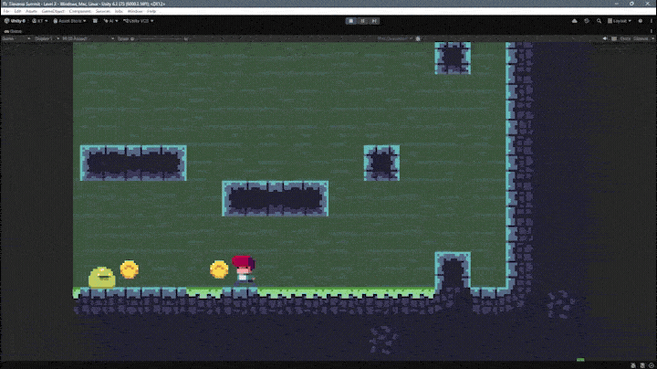
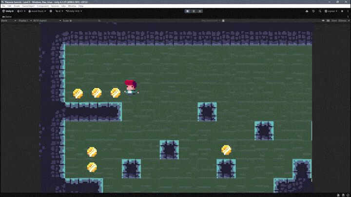
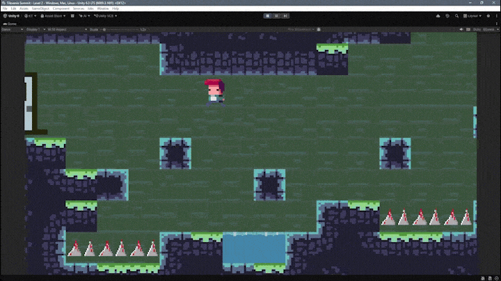
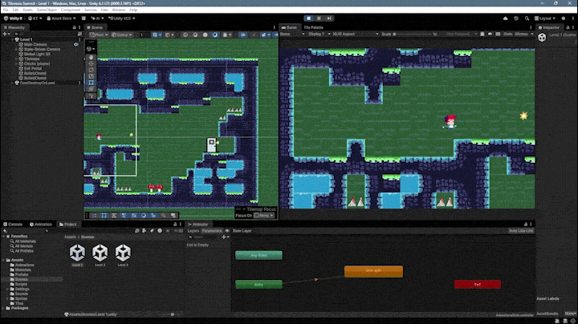

# Tilevania Summit ⭐


A 2D metroidvania-inspired platformer prototype built in Unity while learning game development through hands-on experimentation, debugging, and iteration.

---

## Quick Info

| | |
|---|---|
| Engine | Unity |
| Language | C# |
| Genre | 2D Platformer / Metroidvania-inspired |
| Development Time | Around 2 weeks |
| Estimated Work Time | Around 14 hours |
| Project Type | Learning Prototype |
| Current Status | Completed with some known bugs |

---

<h2 align="center">Gameplay</h2>

<p align="center">
  
</p>

> Watch the full gameplay and behind-the-scenes video on LinkedIn:  
> **[Project : Tilevania Summit](https://www.linkedin.com/posts/krishna-tyagi-a620a1376_gamedevelopment-unity-unity2d-ugcPost-7482878411217207296-S5wQ/)**

---

## About the Project

Tilevania Summit is a 2D metroidvania-inspired platformer prototype built while learning Unity.

Instead of simply following step-by-step tutorials, this project focused on understanding how gameplay systems work by experimenting, debugging, and iterating on each feature.

While inspired by games like Hollow Knight, I customized the levels, mechanics, and gameplay to make the project my own while learning Unity fundamentals.
---

## Features

- 2D player movement
- Running, jumping, and climbing
- Player projectile combat
- Enemy behaviour and attacks
- Collectible coin system
- Real-time score updates
- Multiple playable levels
- Door-based scene transitions
- Three-life system
- Current-level restart after death
- Full game restart after losing all lives
- Cinemachine follow camera
- State-driven camera
- Sprite animations
- UI for score and remaining lives
- Coin pickup sound effect
- Tilemap-based level design
- Rule Tiles
- Prefab variants

---

## Player Movement

The player controller includes running, jumping, climbing, sprite flipping, idle animations, and movement animations.

The movement system uses Unity's 2D physics along with Animator state transitions.

<p align="center">
  
</p>

---

## Combat

The player can use a gun to shoot enemies while moving through the levels.

The combat system includes player projectiles, collision detection, enemy damage, enemy animations, and interactions between the player and enemies.

<p align="center">
  
</p>

---

## Collectibles

Coins are placed throughout the levels as collectibles.

When collected, they disappear, update the score, play an animation, and trigger a pickup sound effect.

<p align="center">
  
</p>

---

## Camera System

The project uses Cinemachine for its camera system.

I worked with a Cinemachine Follow Camera and State-Driven Camera to create smoother player tracking and better camera behaviour during movement.

<p align="center">
  
</p>

---

## Level Progression

Each level contains an exit door.

When the player reaches the door, the next scene loads. If the player dies, the current level restarts and one life is removed.

After losing all three lives, the game begins again from the start.

<p align="center">
  
</p>

---

## Unity Editor

The levels were built using Unity's Tilemap system.

I first created Rule Tiles and then used them to design the environments. This made it easier to place connected tiles and automatically handle edges, corners, and different tile combinations.

<p align="center">
  
</p>

---

### Unity Systems

- Tilemaps
- Rule Tiles
- Cinemachine
- Animator Controller
- Prefabs
- Prefab Variants
- Physics Materials
- Layers
- Sorting Layers
- Scene Management
- Audio Sources
- Unity UI

### Programming Concepts

- Singleton pattern
- Coroutines
- Collision handling
- Trigger detection
- Scene loading
- Player state management
- Score tracking
- Life management
- Referencing components between scripts

Singletons and coroutines were some of the hardest concepts for me because they were new. I understood their purpose while working on the project, but I still need more practice before I can use them confidently without guidance.

---

## Customisation

The project was created with the help of course resources, but I changed several parts to make it feel more personal.

I initially tried creating the artwork myself, but it did not reach the quality I wanted. For this project, I used the art assets provided with the course and focused more on programming, systems, and level design.

Changes I made include:

- Designing my own levels
- Changing some sprites
- Creating new prefab variants
- Adjusting level layouts
- Changing object placement
- Experimenting with mechanics
- Modifying parts of the project to match my preferences

These changes also introduced new bugs, but solving them became an important part of the learning process.

---
## Development Notes

### Biggest Challenge

The most time-consuming issue throughout the project was debugging enemy movement. Enemies repeatedly became stuck inside walls, which forced me to experiment with colliders, movement logic, and physics interactions until I found a more reliable solution.

Although the behaviour still isn't perfect, solving this bug taught me far more than simply following a tutorial.

### What I Learned

This prototype introduced me to several Unity systems that were completely new to me.

#### Unity

- Tilemaps
- Rule Tiles
- Cinemachine
- Animator Controller
- Prefabs
- Physics Materials
- Scene Management
- Unity UI

#### Programming

- Coroutines
- Singleton Pattern
- Collision Handling
- Trigger Detection
- State Management

The biggest lesson wasn't just learning Unity features—it was learning how different systems depend on one another. Even small changes could unexpectedly affect movement, collisions, animations, or gameplay.
---

## Development

| Category | Details |
|-----------|---------|
| Duration | Around 2 weeks |
| Estimated Work Time | ~14 hours |
| Project Type | Learning Prototype |
| Main Focus | Learning, implementation, experimentation, and debugging |
| Art Assets | Course resources with personal customizations |
| Status | Completed |

---


## Project Structure

```text
Assets/
├── Animations/
├── Audio/
├── Prefabs/
├── Scenes/
├── Scripts/
├── Sprites/
├── Tilemaps/
└── UI/

README_Assets/
├── Hero.gif
├── movement.gif
├── combat.gif
├── coins.gif
├── camera.gif
├── level-transition.gif
└── unity-editor.gif
```

## Getting Started

Clone the repository, open the project using Unity Hub, load the main scene from the `Scenes` folder, and press **Play**.
---

## Play

A downloadable Windows build is not available yet.

For now, the project can be opened and played directly inside the Unity Editor.

A future build may be added through the repository's Releases section.

---

## Note

This project was created as part of my Unity learning journey.

The artwork used in this prototype comes from the course resources. The gameplay systems, customizations, debugging, and implementation work were completed by me as part of the learning process.

---

## Final Thoughts

A month ago, building something like this felt impossible.

Learning game development has changed how I look at games. When I play something now, I also think about what is happening behind the scenes: how the camera works, how enemies move, how animations change, how collisions are handled, and how different systems communicate with each other.

This project also reminded me that progress does not come from endlessly starting new projects.

It comes from finishing them.

My next step is either creating one more prototype or taking part in a game jam and building something within a four-day time limit.

---

## Feedback

Suggestions and feedback are always welcome.

If you have any ideas or improvements, feel free to open an issue or connect with me on LinkedIn.

---

⭐ If you enjoyed this project, consider giving the repository a star.